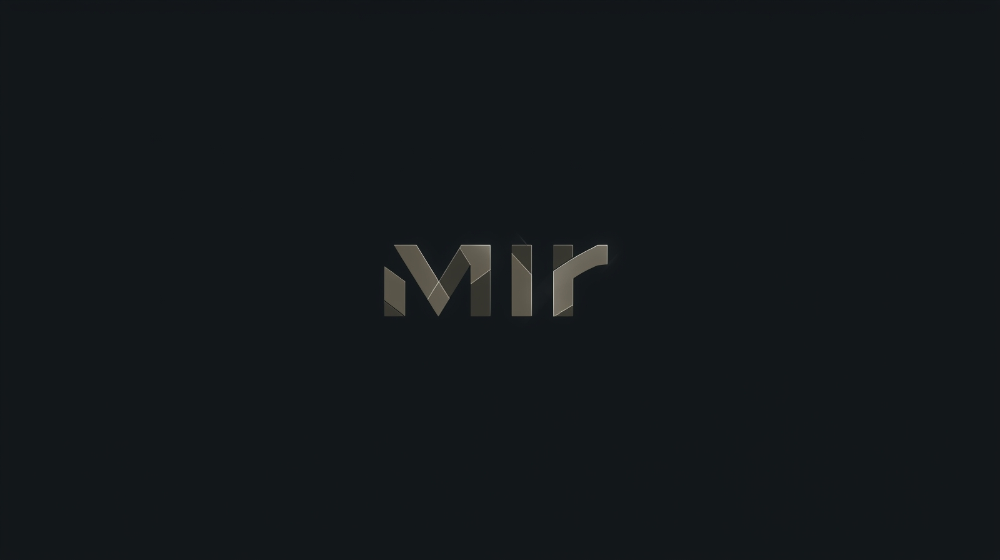

<div align="center">
  
  <h1>Mir</h1>
  <p>My personal collection of dotfiles for Arch Linux, curated for a sleek and powerful Hyprland experience.</p>
</div>

---

## 🌟 About

This repository houses my personal dotfiles for my Arch Linux setup, centered around the [Hyprland](https://hyprland.org/) Wayland compositor. This configuration is meticulously crafted to be both aesthetically pleasing and highly functional, with a strong emphasis on a keyboard-driven workflow.

## ✨ Features

-   **Window Manager**: 🖼️ [Hyprland](https://hyprland.org/) - A dynamic tiling Wayland compositor with fluid animations and extensive customization.
-   **Bar**: 📊 [Waybar](https://github.com/Alexays/Waybar) - A highly customizable Wayland bar for system information, workspaces, and more.
-   **Launcher**: 🚀 [Rofi](https://github.com/davatorium/rofi) - A versatile application launcher and window switcher.
-   **Terminal**: 💻 [Alacritty](https://github.com/alacritty/alacritty) & [Kitty](https://sw.kovidgoyal.net/kitty/) - Fast, GPU-accelerated terminal emulators.
-   **Shell**: 🐠 [Fish](https://fishshell.com/) with [Starship](https://starship.rs/) prompt - A modern, user-friendly shell with a powerful and customizable prompt.
-   **Text Editors**: 📝 [Neovim](https://neovim.io/) & [Vim](https://www.vim.org/) - The classic, powerful text editors, with custom configurations for a superior experience.
-   **Theming**: 🎨 Dynamic theming with [Matugen](https://github.com/InioX/matugen), which generates a color palette from the current wallpaper and applies it across various applications.
-   **Scripts**: 🛠️ A collection of helper scripts to automate system setup and management.

## 🚀 Installation

These dotfiles are managed with `stow`. To install them, clone this repository and use `stow` to create the necessary symlinks:

```bash
curl -fsSL https://raw.githubusercontent.com/r181104/mir/master/scripts/install | sh
```

## ⚙️ Configuration Details

### Hyprland

The Hyprland configuration is located in `~/.config/hypr/hyprland.conf`. It is modular, with different aspects of the configuration split into separate files in `~/.config/hypr/conf/`:

-   `monitors.conf`: 🖥️ Monitor and display settings.
-   `enviromentalvars.conf`: ENV variables.
-   `settings.conf`: ⚙️ General settings and input configuration.
-   `keybinds.conf`: ⌨️ Keyboard shortcuts.
-   `startup.conf`: 🚀 Autostart applications.
-   `decorations.conf`: 🎨 Window decorations and styling.
-   `windowrules.conf`: 룰 Window rules.
-   `snappy-animations.conf`: ✨ Animation settings.

### Waybar

The Waybar configuration is in `~/.config/waybar/config.jsonc`, and the styling is in `~/.config/waybar/style.css`. The bar is configured to show:

-   Workspaces
-   Current window title
-   System tray
-   Notifications
-   Clock
-   Network, CPU, memory, and disk usage
-   Audio volume
-   Battery status
-   A lock button

### Rofi

The Rofi configuration is at `~/.config/rofi/config.rasi`. It provides a clean and simple application launcher.

### Alacritty & Kitty

The terminal configurations are at `~/.config/alacritty/alacritty.toml` and `~/.config/kitty/kitty.conf`. They use the "MesloLGS Nerd Font" and have a transparent background.

### Vim & Neovim

The Vim configuration is at `~/.vimrc` and the Neovim configuration is in `~/.config/nvim/`. They include a variety of settings for a better editing experience, such as:
-   Sensible defaults
-   Custom keybindings for easier navigation and window management
-   A custom statusline
-   A function to toggle comments

## 📜 Scripts

The `~/scripts` directory contains several useful scripts:

-   `arch-pkgs`: Installs a predefined set of packages for a new Arch Linux installation.
-   `aur-installer`: Installs an AUR helper (yay or paru).
-   `black-installer`: Sets up the BlackArch repository.
-   `chaotic-aur`: Sets up the Chaotic-AUR repository.
-   `firewall`: Configures UFW with sensible defaults.
-   `intel-undervolt`: Undervolts Intel CPUs to reduce heat and improve battery life.
-   `llms`: Downloads and sets up a local large language model.
-   `optimize-network`: Optimizes network settings by changing DNS and disabling Wi-Fi power saving.
-   `pacman-conf`: Applies a custom `pacman.conf` with parallel downloads and other tweaks.
-   `power`: Sets up TLP for power management.
-   `sddm-setup`: Sets up the SDDM display manager with a custom theme.
-   `setup-git`: Helps configure Git and SSH for a new machine.
-   `tty-setup`: Customizes the TTY with a new font and color scheme.
-   `wset` & `wset-backend`: A script to set a wallpaper and apply a new color scheme to the entire system using `matugen`.
-   `ani-cli`: A script to watch anime from the command line.

## 🎨 Theming

This setup uses `matugen` to generate a color scheme from the current wallpaper. The `wset` script automates this process. When you run `wset`, it will:

1.  Prompt you to select a wallpaper from your `~/Wallpapers` directory.
2.  Set the selected image as your wallpaper using `swww`.
3.  Generate a new color scheme with `matugen`.
4.  Reload Hyprland, Waybar, and SwayNC to apply the new theme.

## ⌨️ Keybindings

The main keybindings are defined in `~/.config/hypr/conf/keybinds.conf`. Here are some of the most important ones:

-   `Super + Enter`: Open Alacritty
-   `Super + Q`: Close the active window
-   `Super + Space`: Open Rofi
-   `Super + [1-9]`: Switch to workspace 1-9
-   `Super + Shift + [1-9]`: Move the active window to workspace 1-9
-   `Alt + H/J/K/L`: Move focus between windows

For a full list of keybindings, please refer to the `keybinds.conf` file.

## 🖼️ Gallery

*(Coming soon...)*

## 🙏 Acknowledgements

A big thank you to the creators and maintainers of all the amazing open-source software that makes this setup possible.

---
<div align="center">
  <p>Made with ❤️ and a lot of ☕</p>
</div>
